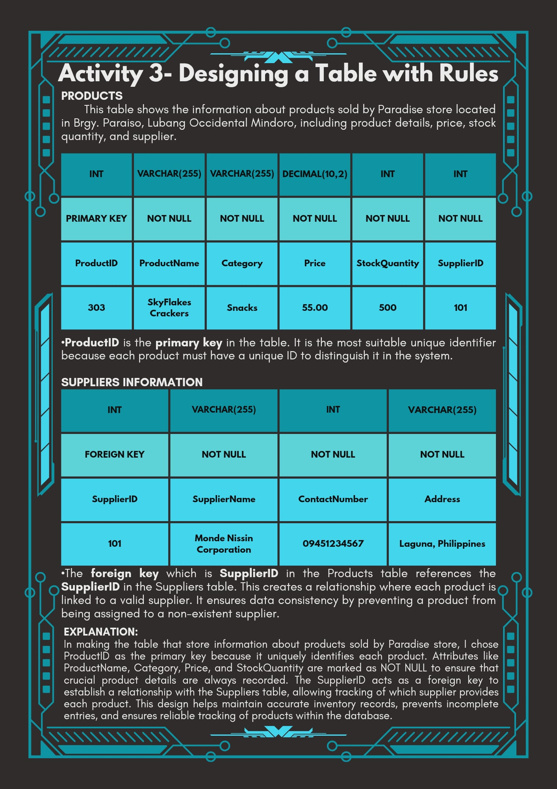

# Coding My Future | IT Student
Hi, I’m Keyh! I’m an IT student exploring my passion for technology while pursuing my love for writing and creative projects. I enjoy designing, tinkering, and editing, combining my technical skills and artistic talents. My journey includes roles such as editing films and posters for school projects and learning how technology can enhance storytelling and creativity.

### About Me
Birthdate: December 05, 2005

Phone Number: 09457456951  

Address: 115-C Andres Bonifacio St., Lubang, Occidental Mindoro  

## Objectives
To gain practical experience and hands-on knowledge to further develop my skills and understanding of the IT industry. I aim to immerse myself in various aspects of IT, such as software development, network administration, and database management.

## Education
- Tertiary:  
  Occidental Mindoro State College – Bachelor of Science in Information Technology  
- Senior High School:  
  Lubang Integrated School – STEM Strand (2022–2024)  
- Junior High School:  
  Lubang Integrated School – Special Science Class (2017–2022)  
- Primary:  
  Lubang Integrated School (2010–2017)

## Achievements
- *1st Year College:* Dean's List - Top 2 (1st Semester) 
- *Senior High School:* With High Honors, Best in Work Immersion  
- *Junior High School:* With Honors, Conduct Awardee, Perfect Attendance  
- *Primary:* With Honors, Conduct Awardee, Perfect Attendance  

## Seminars and Training
- Journalism 2017
- Student Leadership Formation Training 2025

## Skills and Interests
- *Learning and Exploring:* Studying programming concepts like HTML, CSS, and python.
                            Familiarizing myself with design tools and web development techniques.
- *Designing and Editing:* Creating book covers for my own story, editing posters and films for school projects.
- *Writing and Technology Integration:* Writing stories and collaborating with co-writers on different platforms.
                                        Exploring ways to use IT knowledge to create personalized writing tools.
- *Growth Mindset:* Open to new challenges and always seeking to expand my knowledge in IT and creative fields.

## Projects and Activities
- *Film and Poster Editing:* Edited creative school projects for the subject Filipino 1.  
- *Login Form Project:* Created a beginner-level functional login form using HTML, CSS, and JavaScript.  
- *AsteriaPoetica.com:* Personal website (in progress) to showcase creativity and skills.  
- *Book Covers and Graphics:* Designing captivating book covers for Wattpad stories using tools like IbisPaint.
- *Visual Basic Projects (2nd Year):* Designed a calculator, a library management system, a certificate of registration, and a digital menu using Visual Basic 2013.
  ![Calculator]
- *Database Systems Project:* Developed an Entity Relationship Diagram (ERD) as part of Fundamentals of Database Systems.
  
- *Digital Poster:* Designed a creative digital poster for academic and extracurricular activities.
  

## Hobbies
- Writing stories and poems
- Reading novels and articles
- Painting and drawing
- Taking photos of beautiful scenery
- Editing pictures and videos
- Watching K-dramas

## My Aspirations
As an IT student, writer, and editor, I aim to blend my technical and artistic skills to create impactful work. Whether it’s building a collaborative platform for writers, designing visually compelling media, or editing creative projects, I’m excited to continue exploring where technology meets creativity.

## Contacts
I'm always open for everyone, whether you need help, advice, or just someone to talk to. Feel free to reach out to me through the platforms below:
- Facebook Account: Keyh Cajayon
- Instagram Account: kikay_logue
- TikTok Account: kc
- Email Me: keyhcajayon@gmail.com
